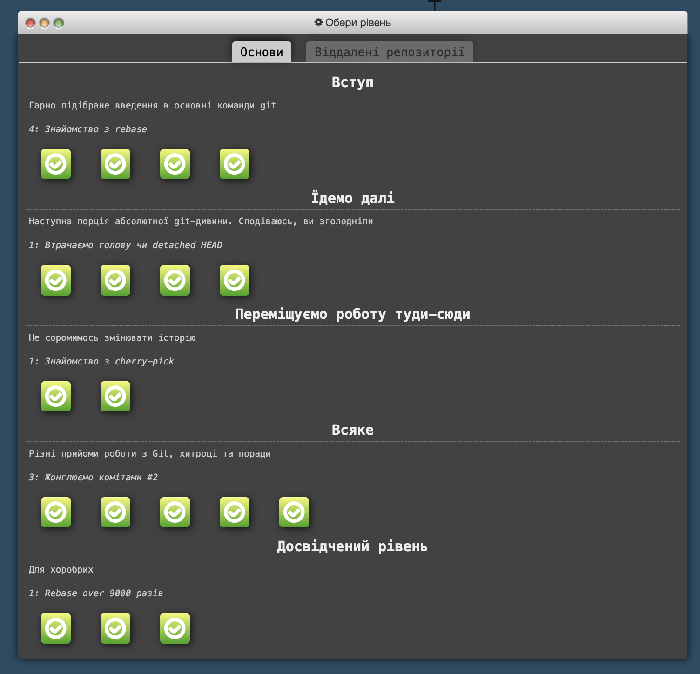
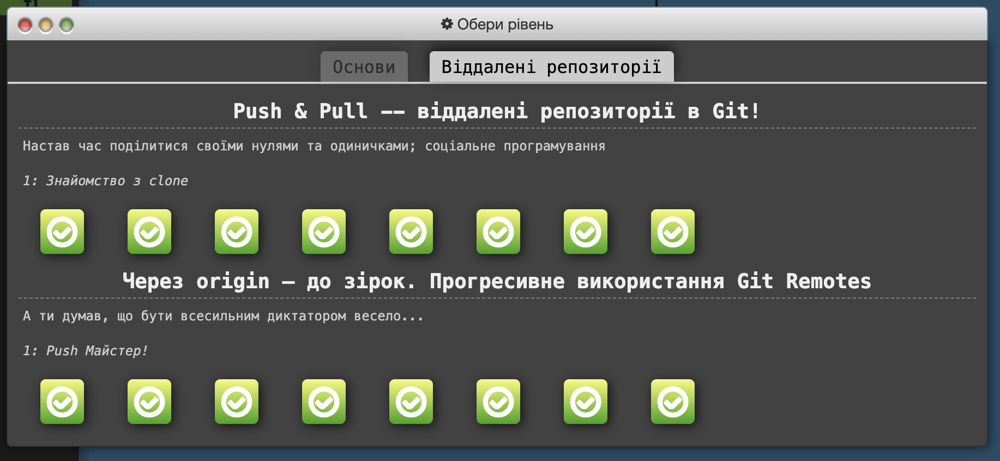

# kottans-frontend
Learning frontEnd with kottans

 ## Git Basics

Схоже, потроху починаю розумітись на Git)) Але треба вже на практиці закріпити це все)
Було трошки важко, але друга частина (на сайті learngitbranching.js.org) більш сподобалась

- По Курсері - трошки затягнуто, але зато все "розжовують".
- По learngitbranching - дуже наглядно і швидко, але інколи незрозуміло.
   Нове все було, використовувати все планую)) Здивувало, що якось тяжко пішло)))

 ## Linux CLI, and HTTP

По [Linux](https://github.com/rukhlovka/kottans-frontend/tree/main/task_linux_cli) було не дуже складно і цікаво, але інформацію по HTTP треба ще переварити. Особливо цікаво було про гешування.

## Git Collaboration

Дуже багато функцій, які трошки змішались в голові. Але думаю з часом на практиці це все має дійти до автоматизму. Взагалі: в захваті від можливостей Git.

