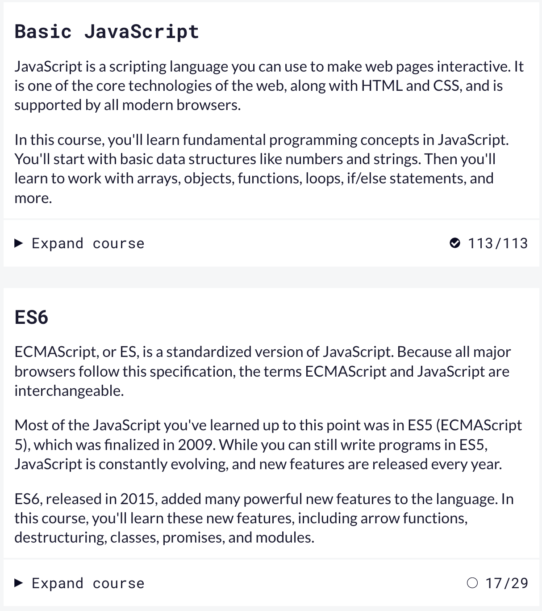
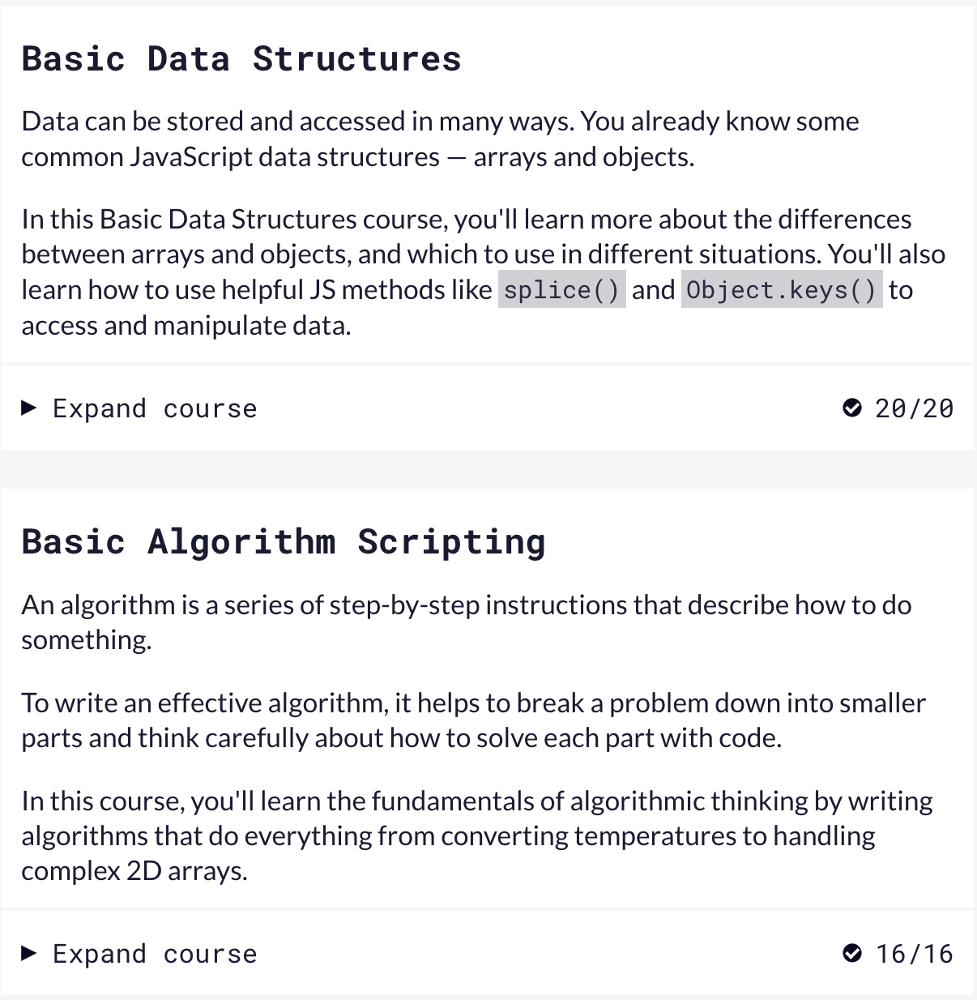
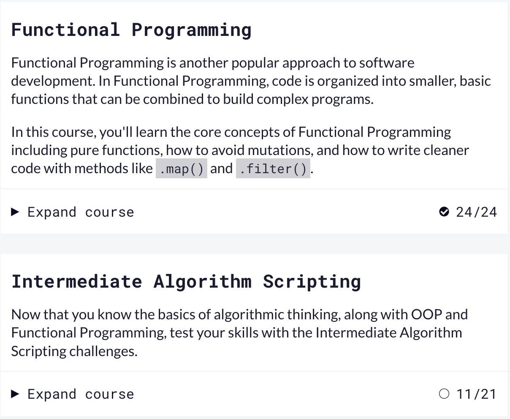
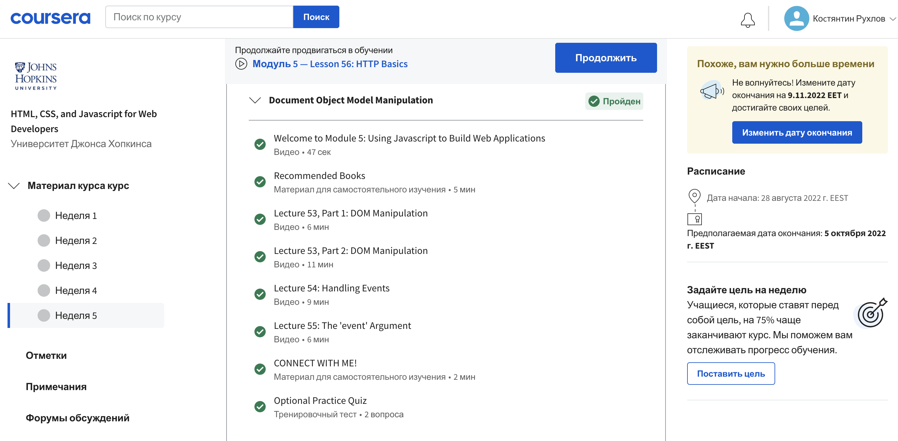
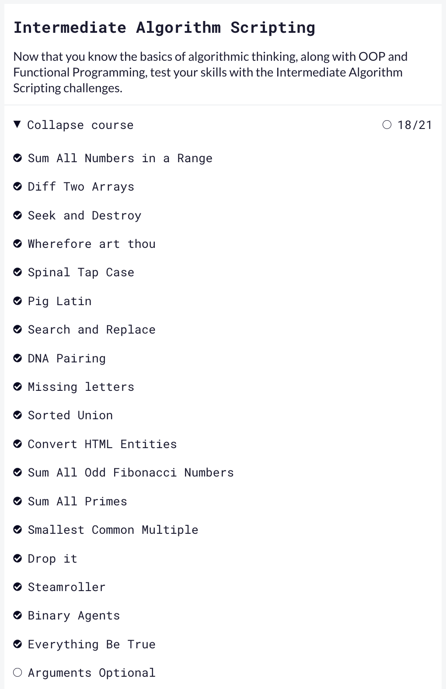
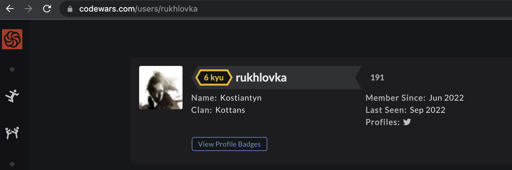

# kottans-frontend
Learning frontEnd with kottans

 ## Git Basics

Схоже, потроху починаю розумітись на Git)) Але треба вже на практиці закріпити це все)
Було трошки важко, але друга частина (на сайті learngitbranching.js.org) більш сподобалась

- По Курсері - трошки затягнуто, але зато все "розжовують".
- По learngitbranching - дуже наглядно і швидко, але інколи незрозуміло.
   Нове все було, використовувати все планую)) Здивувало, що якось тяжко пішло)))

 ## Linux CLI, and HTTP

По [Linux](https://github.com/rukhlovka/kottans-frontend/tree/main/task_linux_cli) було не дуже складно і цікаво, але інформацію по HTTP треба ще переварити. Особливо цікаво було про гешування.

## Git Collaboration

Дуже багато функцій, які трошки змішались в голові. Але думаю з часом на практиці це все має дійти до автоматизму. Взагалі: в захваті від можливостей Git.

## Intro to HTML and CSS

Колись давно це вчив, але зараз додалось багато нового та цікавого. В HTML5 з'явилиць цікаві теги, наприклад "footer", "header, "nav , "main", тощо.

По CSS цікаво було розібратись з функцією для роботи різних стилів, в залежності від розміру екрану.

## Responsive Web Desig

Тут все для мене було нове. До цього не знав про Flexbox, а про Grid дуже віддалено чув, а виявилось що це дуже і дуже цікаво.

Спробував зверстати домашку по Flexbox від "Фрілансера по життю" (перший скрін).

Ігри сподобались. Легко і ненапряжно)

## HTML-CSS-Popup

Ще чекає merge...

Цікаво робити на чистому CSS popup меню.

[Demo](https://rukhlovka.github.io/study/html-css-popup/) | [Code base](https://github.com/rukhlovka/rukhlovka.github.io/tree/main/study/html-css-popup)

## JS Basics

Багато цікавого дізнався про методи та функції в JS.
Цікаво було вирішувати задачки. Деякі схожі робив вже на codewars. Але на деякі витратив забагато часу.

## DOM

Ще чекає merge...

Сподобалась концепція роботи сайту з підгрузкою даних з js файлу.

[Demo](https://rukhlovka.github.io/study/js-dom/) | [Code base](https://github.com/rukhlovka/rukhlovka.github.io/tree/main/study/js-dom)

## Object Oriented JS

Ще чекає merge...

Гру було цікаво робити. Можливо, колись вернусь і дороблю ще якісь фічі в грі.

[Demo Frogger](https://rukhlovka.github.io/frontend-nanodegree-arcade-game/) | [Code base](https://github.com/rukhlovka/frontend-nanodegree-arcade-game/blob/master/js/app.js)

